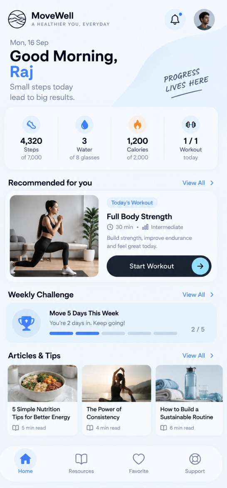
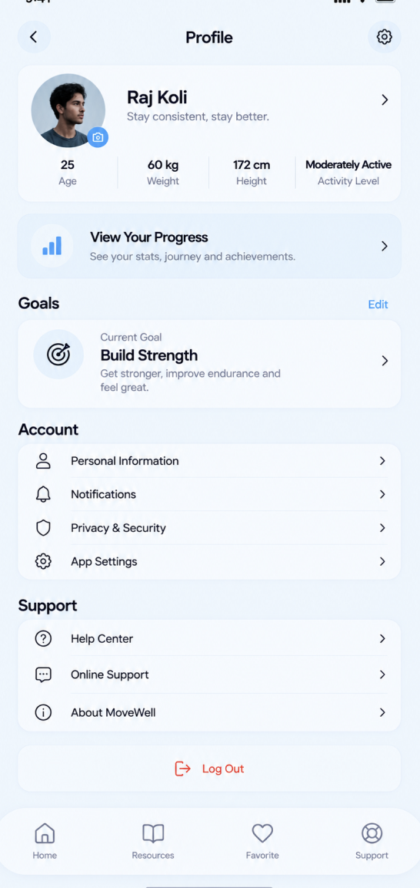
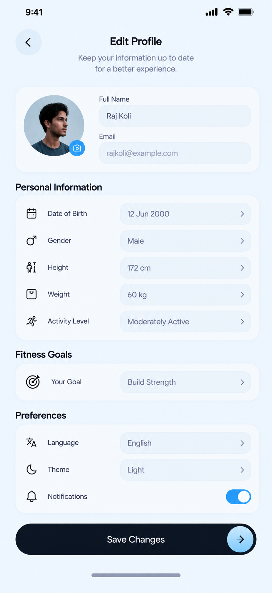
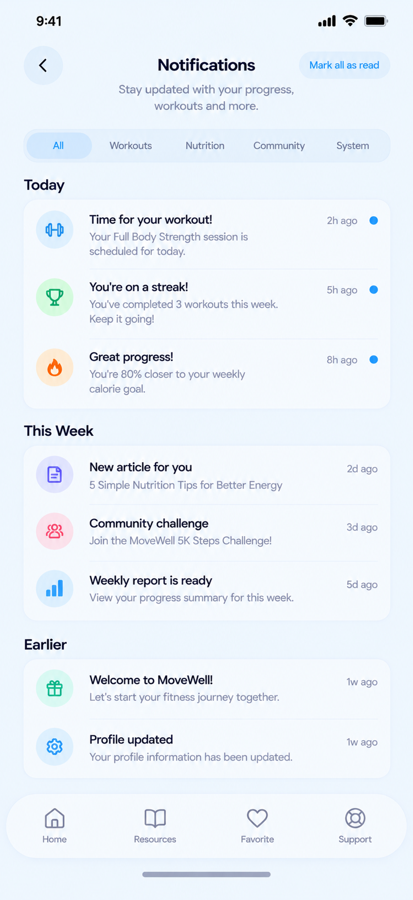
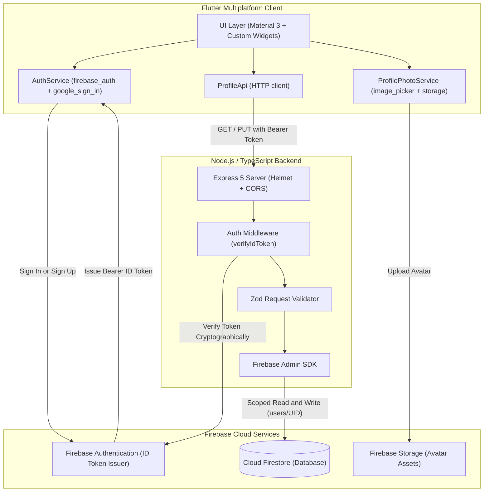

# MoveWell — Intelligent Fitness & Workout Tracker

<div align="center">

  

  <h3>Mindful Movement. Precision Tracking. Seamless Sync.</h3>

  <p align="center">
    A production-grade, full-stack fitness and wellness application built with <strong>Flutter</strong> and backed by a secure <strong>Node.js / TypeScript</strong> Cloud API with <strong>Firebase Authentication</strong> and <strong>Cloud Firestore</strong>.
  </p>

  <p align="center">
    <a href="#key-features">Features</a> •
    <a href="#design-description--uiux-philosophy">Design System</a> •
    <a href="#app-showcase">Screenshots</a> •
    <a href="#system-architecture">Architecture</a> •
    <a href="#getting-started">Getting Started</a> •
    <a href="#backend-api-reference">API Reference</a>
  </p>

  <p align="center">
    
    
    
    
    
    
    
    
  </p>

</div>

---

## Table of Contents

- [Overview](#overview)
- [Design Description & UI/UX Philosophy](#design-description--uiux-philosophy)
- [Key Features](#key-features)
- [App Showcase](#app-showcase)
- [System Architecture](#system-architecture)
- [Repository Structure](#repository-structure)
- [Getting Started](#getting-started)
  - [Prerequisites](#prerequisites)
  - [1. Firebase Setup](#1-firebase-setup)
  - [2. Backend Setup](#2-backend-setup)
  - [3. Flutter Setup & Launch](#3-flutter-setup--launch)
- [Backend API Reference](#backend-api-reference)
- [Security & Architecture Highlights](#security--architecture-highlights)
- [Testing](#testing)
- [License & Attribution](#license--attribution)

---

## Overview

MoveWell bridges the gap between aggressive, intimidating gym trackers and mindful daily wellness. It delivers an intuitive, personalized workout and health experience:

- **Personalized Onboarding**: An 8-step assessment calculating personalized caloric and macronutrient targets based on biometric input.
- **Enterprise-Grade Security**: Complete client-server separation with a zero-client-secret architecture. Device clients authenticate via Firebase, exchanging short-lived ID tokens with an Express/TypeScript backend utilizing the Firebase Admin SDK.
- **Resilient Offline-Ready Client**: State machines prevent UI desynchronization, while smart image fallbacks (Base64 data URIs + asset defaults) guarantee zero visual degradation even under poor network conditions.

---

## Design Description & UI/UX Philosophy

MoveWell's visual language departs from conventional "hyper-aggressive" neon-and-black fitness apps. Instead, it adopts a **calming, Nordic athletic minimalism**—designed to reduce friction, eliminate cognitive overload, and foster sustainable daily habits.

```
┌─────────────────────────────────────────────────────────────────────────────┐
│                             MOVEWELL DESIGN SYSTEM                          │
├───────────────────┬─────────────────────────────────────────────────────────┤
│ Concept           │ Calming Athleticism (Clarity • Fluidity • Tactile Grace)│
├───────────────────┼─────────────────────────────────────────────────────────┤
│ Primary Canvas    │ #E9F2F9 (Ice Blue) & #F0F8FF (Morning Sky)              │
│ Surface Tint      │ #FFFFFF (Crisp White) with #E6F2FD (Card Glow)          │
│ Ink & Typography  │ #111827 (Deep Charcoal) & #1F2937 (Graphite Slate)      │
│ Accent Colors     │ #5B8FC4 (Move Blue) & #A2D9FC (Vibrant Sky)             │
│ Neutral Muted     │ #55677A (Cool Slate) & #D8E6F2 (Subtle Divider)         │
└───────────────────┴─────────────────────────────────────────────────────────┘
```

### 1. Calming Pastel & Deep Slate Palette
- **Canvas (`#E9F2F9` / `#F0F8FF`)**: A soft morning ice-blue background reduces ocular strain during indoor workout sessions and late-night meal tracking.
- **Elevation through Tint rather than Heavy Shadows**: Cards utilize subtle tinting (`#E6F2FD`) and hairline borders (`#D8E6F2`) instead of muddy drop shadows, creating a lightweight, floating aesthetic.
- **High-Contrast Typography (`#111827`)**: Crisp dark ink ensures all metrics (reps, sets, heart rate, calories) remain effortlessly legible at arm's length while on exercise equipment.

### 2. Tactile Micro-Interactions & Gestures
- **`SlideActionPillButton`**: High-intent actions (like completing onboarding, locking in profile changes, or finishing an intense workout) utilize an Apple-inspired horizontal slide-to-confirm mechanism. This prevents accidental taps caused by sweaty hands during training.
- **Interactive Ruler Wheels**: Weight and height selection during onboarding employ continuous tactile scroll rulers that provide immediate visual feedback.
- **Concentric Activity Rings**: Visual progress indicators that translate complex metabolic data into immediately digestible daily completion arcs.

### 3. Adaptive Asset & Avatar Architecture
- Built with a universal component `AppAvatarImage` that dynamically resolves images across three tiers:
  1. **Remote Cloud Storage**: High-resolution network URLs cached locally.
  2. **Base64 Data URIs**: Instant fallback storing profile photos locally without blocking on remote bucket uploads.
  3. **Vector Asset Fallbacks**: Smooth default vectors ensuring no broken image placeholders ever appear.

---

## Key Features

| Category | Highlights |
| :--- | :--- |
| **Authentication** | • Email & Password registration with display name syncing<br>• One-tap Google Sign-In (iOS, Android, Web)<br>• Secure password-reset flow with email verification<br>• Persistent local session recovery |
| **Guided Onboarding** | • Interactive 8-step setup flow: Gender -> Age -> Height -> Weight -> Activity Level -> Fitness Goal -> AI Metric Assessment -> Completion<br>• State-machine guards preventing direct skips before profile completion |
| **Dashboard & Metrics** | • Concentric progress rings for Active Calories, Daily Steps, and Water Intake<br>• Upcoming scheduled workouts and personalized daily routines<br>• Health insight articles and motivational milestones |
| **Workout Engine** | • Multi-tier categorization: Cardio, Strength, Mobility, and Yoga<br>• Equipment, muscle group, and difficulty filters (Beginner, Intermediate, Advanced)<br>• Guided workout session timers and animated exercise cards |
| **Nutrition & Hydration** | • Daily macronutrient targets: Protein, Carbohydrates, and Healthy Fats<br>• Interactive one-tap water hydration tracker<br>• Balanced meal recommendations and healthy recipe directory |
| **Profile & Preferences** | • Camera capture & Photo Library avatar updates with runtime permission guards<br>• Editable body metrics with automatic BMI recalculation<br>• Notification preference management and security settings |

---

## App Showcase

<div align="center">
  <table>
    <tr>
      <td align="center" width="25%">
        <br>
        <strong>Home Dashboard</strong><br>
        <em>Activity rings & quick start</em>
      </td>
      <td align="center" width="25%">
        <br>
        <strong>Profile & Metrics</strong><br>
        <em>Biometric history & badges</em>
      </td>
      <td align="center" width="25%">
        <br>
        <strong>Edit Profile</strong><br>
        <em>Photo picker & settings</em>
      </td>
      <td align="center" width="25%">
        <br>
        <strong>Notifications</strong><br>
        <em>Categorized alerts & reminders</em>
      </td>
    </tr>
  </table>
</div>

---

## System Architecture

MoveWell enforces a strict **Zero-Client-Secret Architecture**. The mobile client never receives or stores administrative credentials. All database writes are guarded by an authenticated Node.js / TypeScript microservice.



### Security Highlights
- **Scoped User Ownership**: Each user can only read and write their own record (`users/{firebaseUid}`).
- **Deny-by-Default Client Rules**: Direct Firestore client SDK writes are disabled via `firestore.rules`. All mutations are validated and recorded by the backend.
- **Zod Schema Validation**: Incoming profile payloads are validated against strict runtime schemas before any database mutation occurs.

---

## Repository Structure

```text
Fitness-Workout-App/
├── assets/
│   ├── icons/                 # App logos, brand marks, and iconography
│   ├── images/                # High-res exercise illustrations, banners, and heroes
│   └── references/            # Architecture blueprints & screenshot assets
├── backend/
│   ├── src/
│   │   ├── middleware/        # Firebase ID token verification & auth guards
│   │   ├── routes/            # /health, /api/users/sync, /api/profile
│   │   ├── schemas/           # Zod runtime validation schemas
│   │   └── server.ts          # Express 5 initialization & CORS/Helmet setup
│   ├── test/                  # Backend unit & integration tests
│   ├── Dockerfile             # Container definition for Cloud Run / Docker
│   ├── firestore.rules        # Deny-by-default Firestore rules
│   └── storage.rules          # Scoped avatar upload security rules
├── config/
│   ├── firebase.example.json  # Template for local build-time variables
│   └── firebase.local.json    # Local credentials (git-ignored)
├── ios/                       # Native iOS project (configured with Camera/Photo permissions)
├── android/                   # Native Android project
├── lib/
│   ├── config/
│   │   └── firebase_config.dart # Environment-injected Firebase configuration
│   ├── models/                # UserProfile, SetupModels, Exercise models
│   ├── screens/
│   │   ├── setup/             # 8-step interactive onboarding flow
│   │   ├── auth_screen.dart   # Sign In & Sign Up tabbed view
│   │   ├── home_screen.dart   # Main dashboard with activity rings
│   │   ├── workout_screen.dart# Exercise browser & category filters
│   │   ├── nutrition_screen.dart # Meal planner & hydration tracker
│   │   ├── profile_view_screen.dart # User statistics & personal bests
│   │   └── edit_profile_screen.dart # Avatar uploader & biometric editor
│   ├── services/              # AuthService, ProfileApi, ProfilePhotoService
│   ├── palette.dart           # Design tokens, color system, AppAvatarImage, SlideAction
│   └── main.dart              # Entrypoint & root state-machine navigator
└── test/
    └── widget_test.dart       # Comprehensive 16-suite widget & unit tests
```

---

## Getting Started

### Prerequisites

- [Flutter SDK](https://docs.flutter.dev/get-started/install) (`^3.13.0` or newer)
- [Node.js](https://nodejs.org/) (`v22` or newer) and `npm`
- [Xcode](https://developer.apple.com/xcode/) (for iOS simulator / device debugging on macOS)
- [Android Studio](https://developer.android.com/studio) (for Android emulator / device debugging)
- A [Firebase Project](https://console.firebase.google.com/)

---

### 1. Firebase Setup

1. Create a project in the [Firebase Console](https://console.firebase.google.com/).
2. In **Authentication** -> **Sign-in method**, enable **Email/Password** and **Google**.
3. Create a **Cloud Firestore** database.
4. Deploy the deny-by-default rules located in `backend/firestore.rules`:
   ```bash
   firebase deploy --only firestore:rules
   ```
5. In **Storage**, enable Cloud Storage and deploy the scoped avatar rules in `backend/storage.rules`:
   ```bash
   firebase deploy --only storage
   ```
6. Download the **Admin Service Account Key** (Project Settings -> Service accounts -> Generate new private key) and store it securely on your machine (outside of version control).

---

### 2. Backend Setup

The backend service verifies client ID tokens and controls database persistence.

```bash
# Navigate to the backend directory
cd backend

# Install dependencies
npm install

# Copy the environment template
cp .env.example .env
```

Edit `backend/.env` with your values:
```env
PORT=8080
FIREBASE_PROJECT_ID=your-firebase-project-id
GOOGLE_APPLICATION_CREDENTIALS=/absolute/path/to/service-account.json
CORS_ORIGIN=*
```

Start the local development server:
```bash
npm run dev
# The API will boot on http://localhost:8080
```

Verify backend health:
```bash
curl http://localhost:8080/health
# Expected output: {"status":"ok","timestamp":"..."}
```

---

### 3. Flutter Setup & Launch

1. Return to the root directory and create your local configuration file:
   ```bash
   cp config/firebase.example.json config/firebase.local.json
   ```

2. Fill in your project identifiers inside `config/firebase.local.json`:
   ```json
   {
     "FIREBASE_API_KEY": "AIzaSy...",
     "FIREBASE_APP_ID": "1:...:web:...",
     "FIREBASE_MESSAGING_SENDER_ID": "...",
     "FIREBASE_PROJECT_ID": "your-firebase-project-id",
     "FIREBASE_AUTH_DOMAIN": "your-project.firebaseapp.com",
     "FIREBASE_STORAGE_BUCKET": "your-project.firebasestorage.app",
     "FIREBASE_IOS_BUNDLE_ID": "com.example.movewell",
     "GOOGLE_IOS_CLIENT_ID": "",
     "GOOGLE_SERVER_CLIENT_ID": "",
     "BACKEND_URL": "http://127.0.0.1:8080"
   }
   ```
   > **Note**: For Android emulators, set `BACKEND_URL` to `http://10.0.2.2:8080`. For physical devices on the same Wi-Fi network, use your machine's local IP address (e.g. `http://192.168.1.50:8080`).

3. Fetch dependencies and launch the app:
   ```bash
   flutter pub get
   flutter run --dart-define-from-file=config/firebase.local.json
   ```

---

## Backend API Reference

All `/api/*` endpoints require a valid Firebase ID Token passed in the `Authorization` header:
```http
Authorization: Bearer <Firebase_ID_Token>
```

| Method | Route | Description | Auth Required |
| :--- | :--- | :--- | :---: |
| `GET` | `/health` | Public service health check | No |
| `POST` | `/api/users/sync` | Creates or syncs an authenticated user record after login | Yes |
| `GET` | `/api/profile` | Fetches the complete profile and metrics for the caller | Yes |
| `PUT` | `/api/profile` | Validates and updates profile attributes (name, metrics, goals, preferences) | Yes |

### Profile Payload Schema Example (`PUT /api/profile`)
```json
{
  "name": "Alex Morgan",
  "gender": "Female",
  "age": 28,
  "height": 172.5,
  "weight": 64.0,
  "physicalActivity": "Moderate (3-5 days/week)",
  "fitnessGoal": "Build Lean Muscle",
  "avatar": "https://...",
  "theme": "light",
  "language": "en",
  "notificationPreference": true
}
```

---

## Security & Architecture Highlights

1. **No Sensitive Keys in Version Control**:
   `lib/config/firebase_config.dart` uses compile-time environment injection (`--dart-define-from-file`), ensuring zero API keys or credentials are ever committed to Git.
2. **Strict Identity Verification**:
   The client cannot impersonate another user ID. The backend extracts the `uid` directly from the cryptographically verified Firebase ID token and uses it as the document ID in Firestore (`users/{uid}`).
3. **Graceful Photo Handling**:
   When cloud storage rules are restricted or when working offline, `ProfilePhotoService` encodes uploaded images as compressed data URIs locally, preventing upload failures from breaking user onboarding.

---

## Testing

Both the client application and the backend service feature comprehensive automated test suites.

### Flutter Client Tests (16 Passing Suites)
```bash
flutter test
```
```text
00:01 +16: All tests passed!
MoveWell renders the launch experience
SlideActionPillButton handles drags and hold-to-complete
AuthScreen renders login and registration components
SetupFlowNavigator executes full 8-step onboarding
HomeScreen renders without overflow on 360px mobile viewports
EditProfileScreen supports photo picking and input editing
NutritionScreen & WorkoutScreen verify macro calculations and filters
```

### Backend Tests
```bash
cd backend
npm test
npm run typecheck
```

---

## License & Attribution

This project is licensed under the **MIT License** — see the [LICENSE](LICENSE) file for details.

Developed for mindful health and movement.
